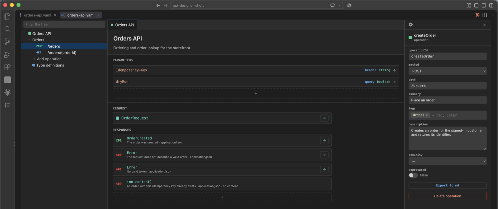
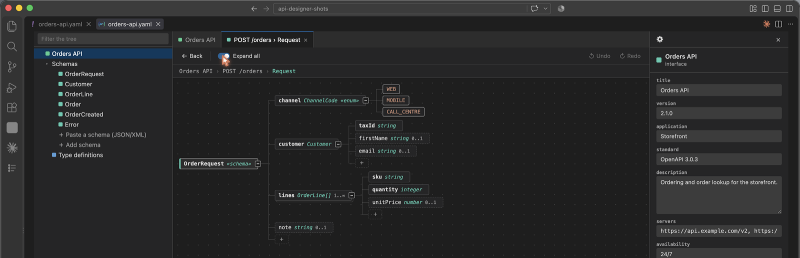

# API Designer

A VS Code extension for creating and editing API and event contracts visually.
Browse models, update fields and generate Markdown documentation without editing
the contract by hand.

Everything runs locally — no network requests, AI, telemetry or usage fees.

## Supported formats

| Format | What you can edit |
|---|---|
| Swagger 2.0 / OpenAPI 3.0–3.2 | Contract details, operations, requests, responses and models |
| WSDL | Types, operation names and documentation; bindings and services stay unchanged |
| XSD | Elements and types |
| Avro (`.avsc`) | Records, fields and enums |

## Installation

Search for **API Designer** by `beatahumeniuk` in the VS Code Marketplace, or run
this command in VS Code Quick Open (`Ctrl+P` / `Cmd+P`):

```text
ext install beatahumeniuk.api-schema-designer
```

You can also download a `.vsix` from
[GitHub Releases](https://github.com/Beata-Humeniuk/api-designer/releases)
and choose **Extensions → … → Install from VSIX**.

## Quick start

1. Open a contract file, such as `openapi.yaml`, `service.wsdl`, `schema.xsd` or `event.avsc`.
2. Run **API Designer** from the Command Palette (`Ctrl+Shift+P` / `Cmd+Shift+P`),
   or right-click the file in the editor or Explorer.
3. Select an operation, model or field and edit its properties in the right panel.
4. Review the changes in the source file and save as usual (`Ctrl+S` / `Cmd+S`).

To start from scratch, run **API Designer: New contract**.

## Visual editing

- **Contract tree:** browse operations and models, filter the list and open requests or responses.
- **Schema view:** explore fields as a collapsible tree showing types, required fields and alternatives.
- **Properties panel:** edit descriptions, types, examples, validation rules and other settings for the selected item.
- **Contract settings (gear icon):** update contract details, export documentation or convert the schema to another format.

Changes appear automatically in the editor buffer. Save as usual when editing;
starting a Markdown export or a schema conversion also saves any pending changes.
The designer also refreshes when the source changes, keeping your current view
where possible. If the file temporarily cannot be read, it keeps the last readable
version and shows a status message.

Edits preserve the contract's format and version. WSDL, XSD and Avro edits retain
unrelated content and formatting.





## Markdown documentation

Choose **Export to md** in an operation's properties to document that operation,
or in contract settings to document the whole contract.

Exports work with all supported formats and include descriptions, operations
where applicable, model tables and supported validation rules. OpenAPI exports
also include response codes and parameter examples stored in the contract.

The suggested save location is beside the source contract. Generated documents
include source metadata and are intended to be regenerated rather than edited by hand.

## Convert a schema to another format

Choose **Convert schema** in contract settings. The source file is left as it
is — the result opens in a new editor, ready to save. Pending edits to the
source are saved first, so the conversion reads the contract you can see.

| Source | Available output |
|---|---|
| Swagger / OpenAPI | WSDL, XSD, Avro |
| WSDL | OpenAPI (YAML or JSON), XSD, Avro |
| XSD | OpenAPI (YAML or JSON), WSDL, Avro |
| Avro | OpenAPI (YAML or JSON), WSDL, XSD |

A conversion carries the data model across, including descriptions, enums and
supported constraints, and asks which object the result is built around. Some
features have to be adapted: inheritance is flattened in Avro, HTTP endpoints
are dropped when converting to XSD or Avro, and a WSDL operation becomes a POST
endpoint, and the other way round an OpenAPI operation becomes a WSDL operation
with its request, response and fault messages. A source with no operations of
its own becomes a contract with exactly one: a GET, or a SOAP operation,
answering with the object you picked.

To convert **between OpenAPI versions** or apply description markers, use the
separate [OpenAPI Converter](https://github.com/Beata-Humeniuk/openapi-converter)
extension. API Designer edits the version already present in the file.

## Links

- [Report a bug](https://github.com/Beata-Humeniuk/api-designer/issues)
- [Privacy and security](SECURITY.md)
- [Changelog](CHANGELOG.md)
- [License](LICENSE) — MIT
